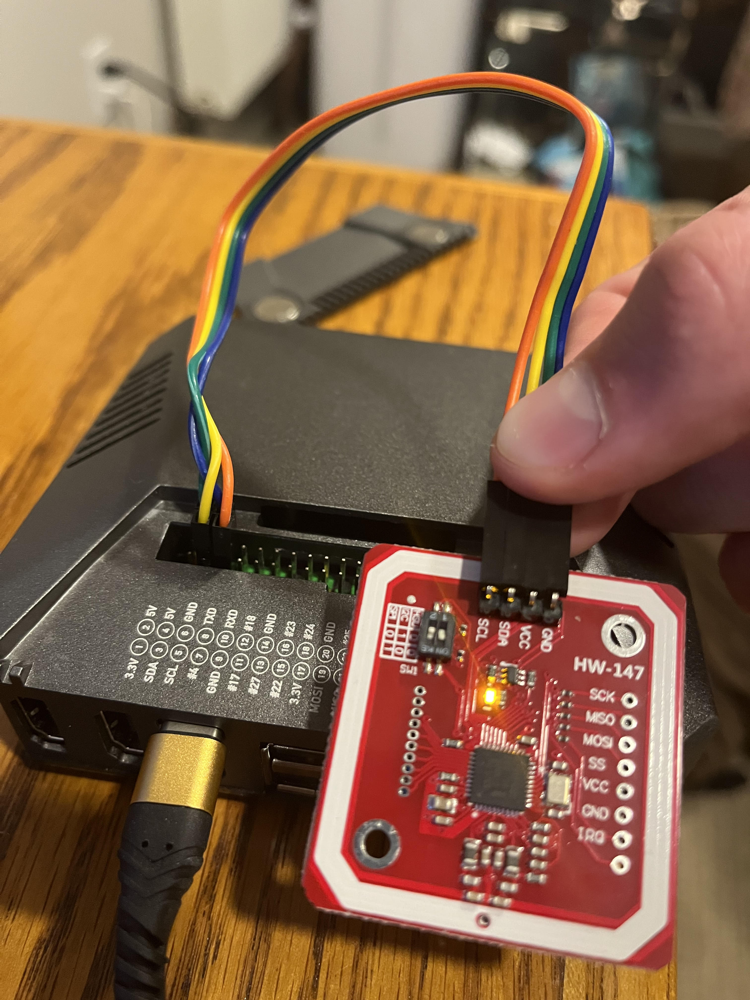
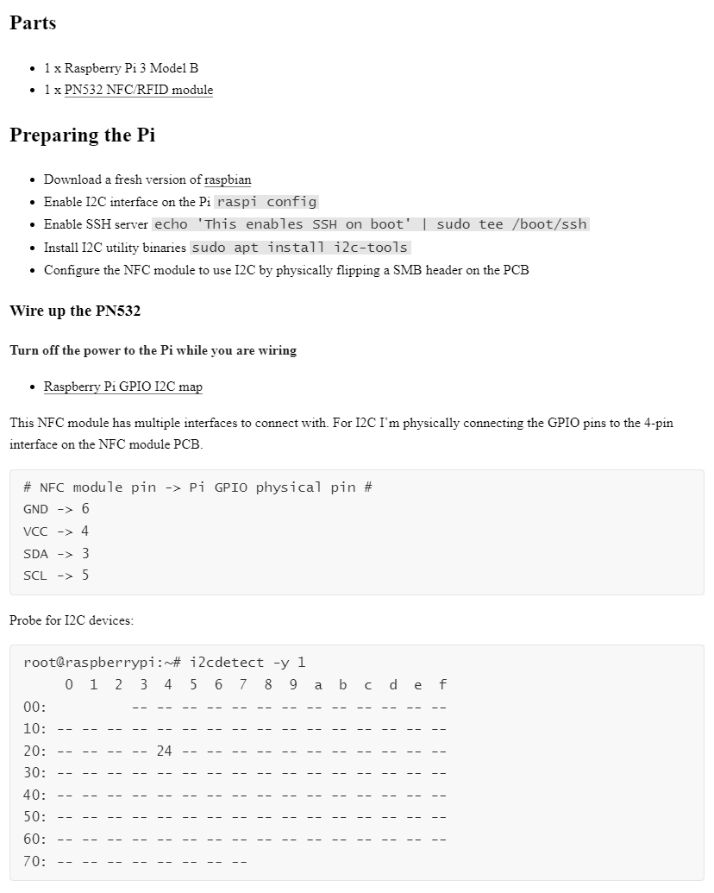
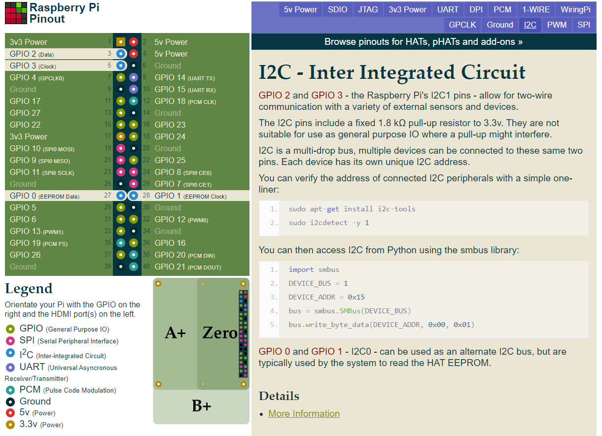

# Setup 🔨

This section will explain the steps needed to setup a Raspberry Pi (4) as an NFC/RFID reader for access to **The Lab**

## Wire it up 🔌

First, wire the Raspberry Pi up to your NFC/RFID reader:

> [setup source](https://blog.stigok.com/2017/10/12/setting-up-a-pn532-nfc-module-on-a-raspberry-pi-using-i2c.html)

> [pinout source](https://pinout.xyz/pinout/i2c)

Ensure that your NFC/RFID reader is in I2C mode:

| off | on |
|-----|----|
|     | x  |
| x   |    |

### Code 💻

[adafruit-pn532-rfid-nfc docs](https://learn.adafruit.com/adafruit-pn532-rfid-nfc/python-circuitpython)
